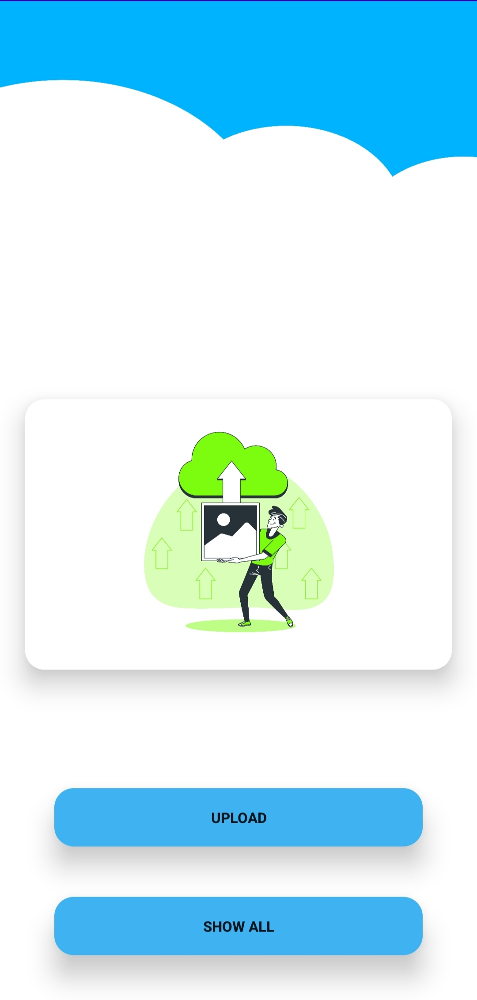
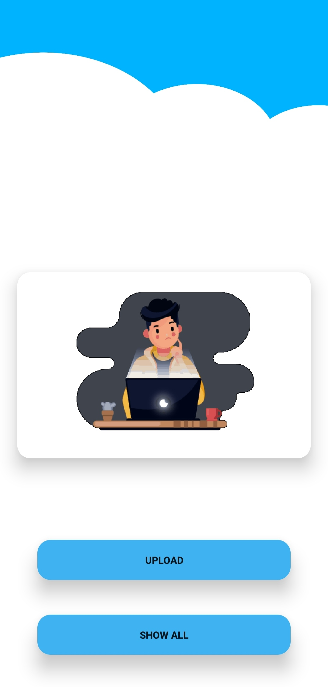
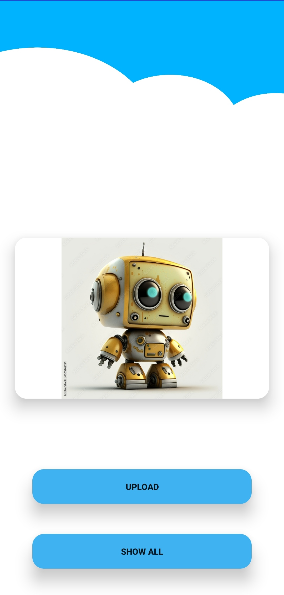
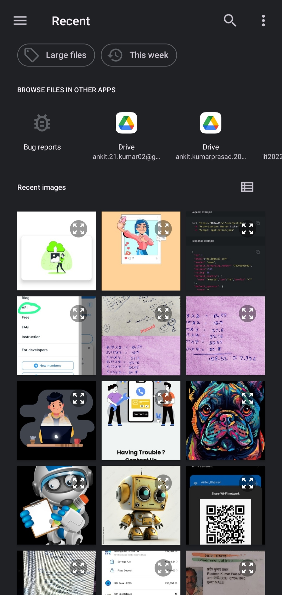

# PhotoBase
Android app to store your photos on the google  real time storage made using firebase. Google firebase is free to use platform providing many features from realtime database to realtime authentication
service. This app enables you to select your photos and upload it directly to storage of this app on cloud. Interactive and simple to use without creating account.

## ✨ Features

- No login required
- Simple and easy to use
- Interactive UI/UX
- No storage limit

## 🖼️ Screenshot

  
  
  

  
  
  

## 🛠️ Installation Step

- Download or clone the repo
- Build gradle and run the project

## 🖥️ Technologies Used

- Android Studio
- Kotlin
- Lottie Animation
- Firebase Storage

[Download the App](apk_file/app-debug.apk)

## 😃 If you liked the app, Please give it a ⭐ and fork the repository. 🙌  

